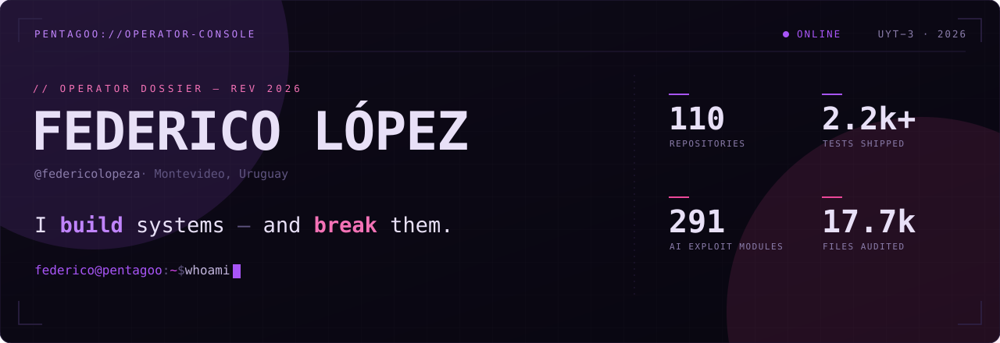
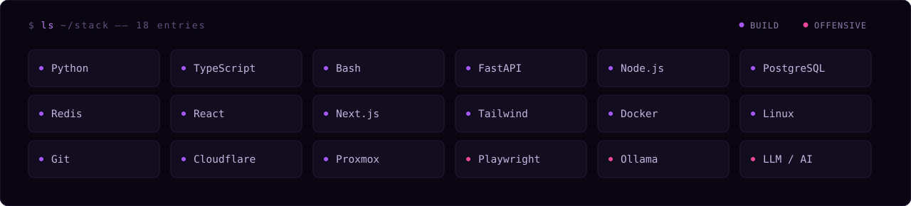
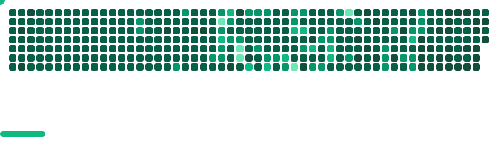

<!--
  root@federico:~$ cat /etc/motto
  I build systems — and break them.
-->

<div align="center">
  
</div>

<br/>

```bash
$ whoami
federico — ingeniero full stack y operador ofensivo. Construyo sistemas que
mueven dinero y datos a escala, y rompo los que no deberían dejarme entrar.

$ cat ./focus
> e-commerce / fintech · automatización · seguridad ofensiva con IA
> del MVP a producción en días, no meses
```

<br/>

## `~/build` &nbsp;<sub>— sistemas que mueven dinero y datos a escala</sub>

<table>
  <tr>
    <td width="50%" valign="top">
      <h3>▸ <a href="https://autop2p.dev">AutoP2P</a></h3>
      <p>SaaS multi-tenant para automatizar anuncios P2P (C2C) de Binance: motor de repricing, gestión multi-anuncio y dashboard en tiempo real. Aislamiento estricto por tenant con RLS en Postgres.</p>
      <p><strong>2.2k+ tests</strong> · <strong>71 ADRs</strong> · arquitectura hexagonal</p>
      <p><code>FastAPI</code> <code>PostgreSQL</code> <code>Redis Streams</code></p>
      <sub>↗ autop2p.dev</sub>
    </td>
    <td width="50%" valign="top">
      <h3>▸ <a href="https://labs.pentagoo.uy">Pentagoo Labs</a></h3>
      <p>Software factory: scrapers industriales, automatización, integraciones (pagos / CRM / ERP), pipelines de datos y dashboards. Del MVP a producción en días, no meses.</p>
      <p><strong>scraping</strong> · <strong>automation</strong> · <strong>data pipelines</strong></p>
      <p><code>Python</code> <code>Playwright</code> <code>Docker</code></p>
      <sub>↗ labs.pentagoo.uy</sub>
    </td>
  </tr>
</table>

## `~/break` &nbsp;<sub>— lo que tu scanner no ve, nosotros lo explotamos</sub>

<table>
  <tr>
    <td valign="top">
      <h3>▸ <a href="https://rekon.sh">Rekon</a> &nbsp;<sub>· offensive security, AI-powered</sub></h3>
      <p>Pentesting potenciado por IA con motor propio: <strong>291 módulos en paralelo</strong> y evidencia encadenada por <code>SHA-256</code>. La IA propone, el operador autoriza — <em>no es auto-pwn.</em></p>
      <p><strong>Operator Gate</strong> — un pentester humano aprueba cada exploit antes de ejecutarlo:</p>
      <p>
        <code>ROE</code> ▸ <code>Recon</code> ▸ <code>Scan</code> ▸ <strong>🔒 OPERATOR&nbsp;GATE</strong> ▸ <code>Exploit</code> ▸ <code>Validate</code> ▸ <code>Report</code>
      </p>
      <p><sub>ROE-gated · fail-closed · evidencia SHA-256 &nbsp;|&nbsp; Pentest · Red Team · IR · Smart Contracts · LLM/AI</sub></p>
      <sub>↗ rekon.sh</sub>
    </td>
  </tr>
</table>

## `~/research` &nbsp;<sub>— disclosure responsable · público · verificable · sin NDA</sub>

<table>
  <tr>
    <td width="50%" valign="top">
      <h3>WebKit / Safari</h3>
      <p>Auditoría de <strong>17.773 archivos</strong> del motor → <strong>3 bugs confirmados</strong>.</p>
    </td>
    <td width="50%" valign="top">
      <h3>WordPress 6.7 · AI Client</h3>
      <p><strong>Prompt injection</strong> → ejecución de PHP en el plugin de IA.</p>
    </td>
  </tr>
</table>

## `~/lab` &nbsp;<sub>— experimento sin miedo · snapshots + rollback</sub>

<p>
  <strong>homelab</strong> &nbsp; <code>Proxmox</code> <code>Coolify</code> <code>Gitea</code> <code>Grafana / Prometheus</code><br/>
  <strong>LLMs locales</strong> &nbsp; <code>Ollama</code> <code>qwen3</code> <code>deepseek-r1</code> <code>Foundation-Sec-8B</code>
</p>

## `~/stack`

<div align="center">
  
</div>

## `~/contrib`

<div align="center">
  
</div>

## `~/contact`

<p>
  <a href="https://federicolopez.uy"><strong>federicolopez.uy</strong></a> &nbsp;·&nbsp;
  <a href="https://federicolopez.uy/blog">blog</a> &nbsp;·&nbsp;
  <a href="https://www.linkedin.com/in/federicolopeza">linkedin</a> &nbsp;·&nbsp;
  <a href="mailto:federico@pentagoo.uy">federico@pentagoo.uy</a>
</p>
<p>
  <sub>build →</sub> <a href="https://autop2p.dev">autop2p.dev</a> &nbsp;·&nbsp;
  <a href="https://labs.pentagoo.uy">labs.pentagoo.uy</a> &nbsp;&nbsp; <sub>break →</sub> <a href="https://rekon.sh">rekon.sh</a>
</p>

```bash
$ echo "status=ONLINE | tz=UYT(UTC-3) | building=AutoP2P·Rekon·Pentagoo | open_to=collaborations"
```
