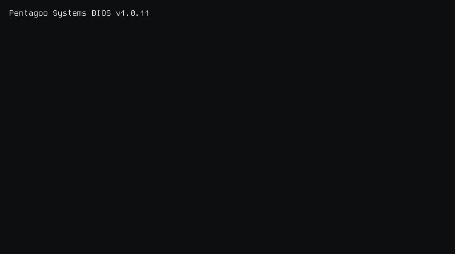

<!-- root@federico:~$ cat /etc/motto
build > hype
-->

<div align="center">
  <picture>
    <source media="(prefers-color-scheme: dark)" srcset="./output.gif">
    <source media="(prefers-color-scheme: light)" srcset="./output.gif">
    
  </picture>
</div>

## `~/about`

```bash
$ whoami
> Federico Lopez — Full Stack Engineer

$ cat location.txt
> Montevideo, Uruguay

$ cat bio.txt
> Scraping, automation, and P2P trading systems at scale.
> Founder @ AutoP2P · Pentagoo Labs.

$ ls -la ventures/
drwxr-xr-x  autop2p/        # P2P trading automation SaaS
drwxr-xr-x  pentagoo-labs/  # Scraping & automation factory
```

<p align="left">
  
  
  
</p>

## `~/products`

<table>
  <tr>
    <td width="50%" valign="top">
      <h3><a href="https://autop2p.dev">AutoP2P</a></h3>
      <p>Bot de trading P2P para Binance. Repricing automático en &lt;1s, gestión multi-anuncio, dashboard en tiempo real. 217+ merchants activos.</p>
      <p>
        
        
      </p>
    </td>
    <td width="50%" valign="top">
      <h3><a href="https://labs.pentagoo.uy">Pentagoo Labs</a></h3>
      <p>Software factory: scrapers industriales (100K+ SKUs/día), pipelines ETL, bots de automatización y APIs para e-commerce y fintech.</p>
      <p>
        
        
      </p>
    </td>
  </tr>
</table>

## `~/stack`

<div align="center">
  
  <br/>
  
</div>

## `~/metrics`

<div align="center">
  
  
</div>

<div align="center">
  
</div>

## `~/contrib`

<div align="center">
  
</div>

<div align="center">
  
</div>

<div align="center">
  
</div>

## `~/contact`

<div align="center">
  <a href="https://federicolopez.uy"></a>
  <a href="https://autop2p.dev"></a>
  <a href="https://labs.pentagoo.uy"></a>
  <br/>
  <a href="mailto:federico@pentagoo.uy"></a>
  <a href="https://www.linkedin.com/in/federicolopeza"></a>
</div>

```bash
$ echo "status=ONLINE | timezone=UYT(UTC-3) | open_to=collaborations"
```
